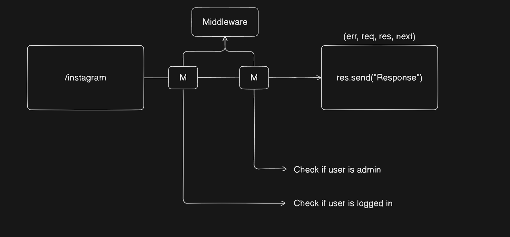

# BACKEND STUDY WITH JAVASCRIPT

# Things that should be considered during building server and database

> - which data we are going to save or store? like username, password, email, dob etc...

> - data modeling

>> 

>> 

> # Middleware 

> - Middleware is a function that runs between the request and response.

> - It can modify the request or response or end the request, or call the next middleware.

> - Common uses:

>> - Logging
>> - Authentication
>> - Error handling

> 